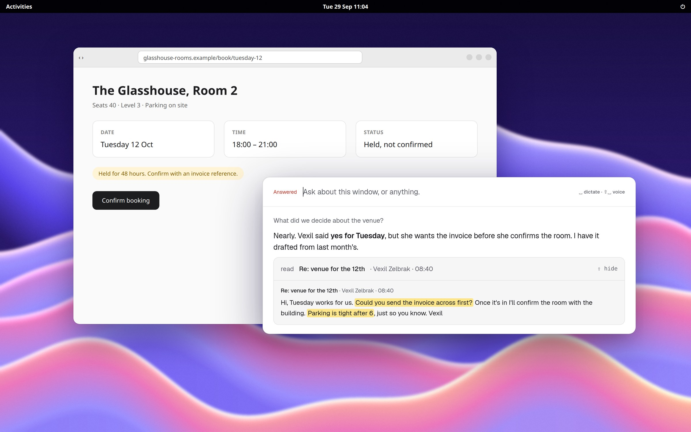

<div align="center">


**Your computer's memory, on Linux.**

An open-source, local-first AI assistant that remembers your screen and your meetings, answers from them, and uses your computer for you.

<p>
  
  
  
</p>



</div>

## What June does

**Remembers your screen.** June reads the window you're working in through the Linux accessibility bus, and takes a screenshot only when an app won't say what's in it. Ask about it days later and the answer quotes the lines it came from.

**Takes your meeting notes.** It hears the call start, records both sides, and transcribes and separates speakers on your machine with whisper.cpp and sherpa-onnx. When the call ends you get what was decided, what was said and what you owe.

**Turns promises into tasks.** Anything you took on in a call lands in Tasks with the meeting beside it. Each morning brings a brief, and each evening a page on the day.

**Talks back.** `Ctrl+Alt+Space` opens the bar over any app. Type, press Space to dictate, or Shift+Space for a live voice conversation.

**Drives your desktop.** It opens apps, finds the button and clicks it, checking every step, and asks before anything it can't undo.

**Stays yours.** Local-first and open source. Memory search runs on llama.cpp on your own machine. Bring the brain you already pay for: a Gemini key, or a Claude or ChatGPT subscription.

<div align="center">

**[Install](#getting-started)** · **[Architecture](docs/architecture.md)** · **[Star on GitHub](https://github.com/M-DEV-1/june)**

</div>

## Getting started

```bash
curl -fsSL https://raw.githubusercontent.com/M-DEV-1/june/main/install.sh | bash
```

1. Run the install command. It names any system libraries that are missing.
2. Log out and back in, so GNOME loads June's window extension.
3. Add a brain: a Gemini API key, or a Claude or ChatGPT subscription.
4. Run `june doctor`. It lists anything still missing.

## Your data

Everything stays on your machine: the database, recordings, screenshots and config. Meeting transcription, speaker separation and memory search run on your machine. The only thing sent out is a request to the brain you picked.

## Uninstall

```bash
curl -fsSL https://raw.githubusercontent.com/M-DEV-1/june/main/packaging/uninstall.sh | bash
```

This removes June's files and leaves your data folder.

## Build from source

Needs Go 1.25+, Rust and pnpm.

```bash
git clone https://github.com/M-DEV-1/june.git && cd june
make release
```

## License

GPLv3
