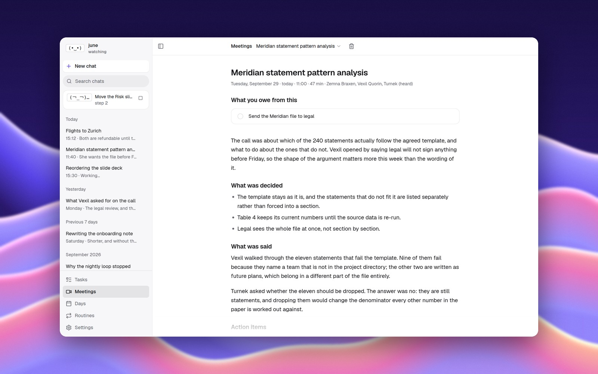
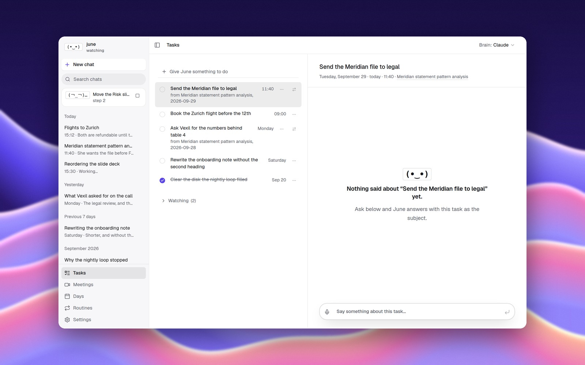
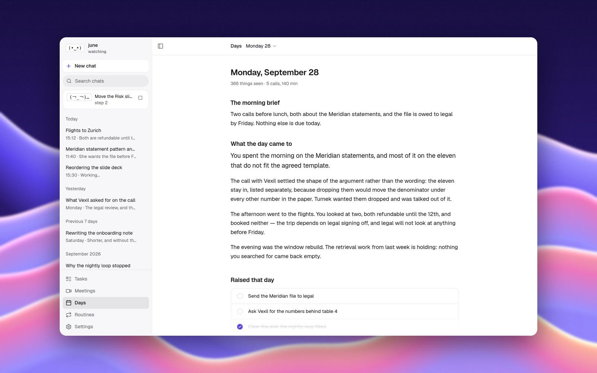

<div align="center">

# June

**Your computer's memory, on Linux.**

June keeps what was on your screen and in your meetings, answers when you ask, and can use the computer for you. Everything is stored on your machine.

```bash
curl -fsSL https://raw.githubusercontent.com/M-DEV-1/june/main/install.sh | bash
```

<sub>GNOME on Wayland · x86_64 · GPLv3</sub>

<br>


</div>

## What it does

- **Remembers your screen.** It reads the focused window through the accessibility bus, and takes a screenshot only when an app will not say what is in it.
- **Answers from memory.** Ask what was said in yesterday's call or what the email said this morning. The answer shows the passages it came from.
- **Takes meeting notes.** It records calls, transcribes and separates speakers on your machine, and writes what was decided and who owes what.
- **Keeps your promises in one list.** Work you took on in a meeting becomes a task, with the meeting it came from beside it.
- **Talks.** Press `Ctrl+Alt+Space` to ask. Space dictates, Shift+Space starts a live voice conversation.
- **Uses the computer.** It opens apps, finds things and clicks them, checks each step, and stops to ask before anything it cannot undo.



<table>
  <tr>
    <td width="50%"></td>
    <td width="50%"></td>
  </tr>
</table>

## Getting started

1. Run the install command above. It names any system libraries that are missing.
2. Log out and back in, so GNOME loads June's window extension.
3. Add a brain: a Gemini API key, or a Claude or ChatGPT subscription.
4. Run `june doctor`. It lists anything still missing.

## Your data

Everything stays in `~/.local/share/june`: the database, recordings, screenshots and config. Meeting transcription, speaker separation and memory search run on your machine. The only thing sent out is a request to the brain you picked.

## Uninstall

```bash
curl -fsSL https://raw.githubusercontent.com/M-DEV-1/june/main/packaging/uninstall.sh | bash
```

This removes June's files and leaves your data folder.

## Build from source

Needs Go 1.25+, Rust and pnpm.

```bash
git clone https://github.com/M-DEV-1/june.git && cd june
make release
```

## License

GPLv3
