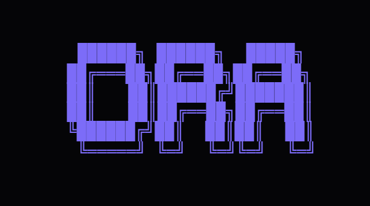

  

# ORA\_

Ora is a thin, Go-native OS companion. It monitors your workspace activity locally and provides instant, voice-first assistance.

If you want to know the height of the Eiffel Tower, use a browser. Ora is for your context, i.e., your files, your windows,
your terminal, and your day.

---

