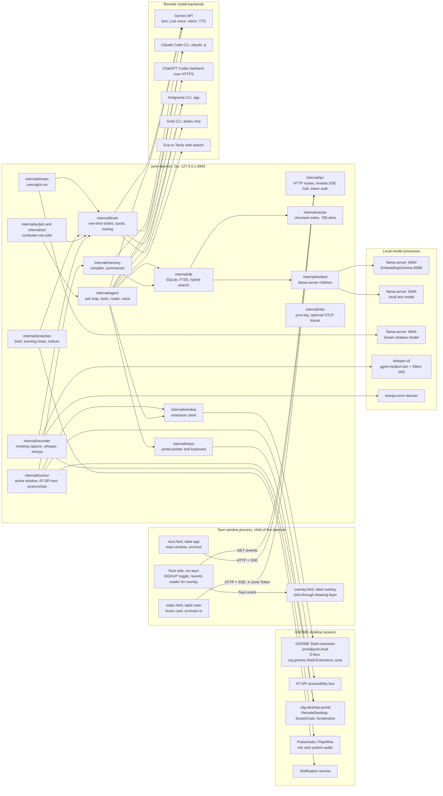
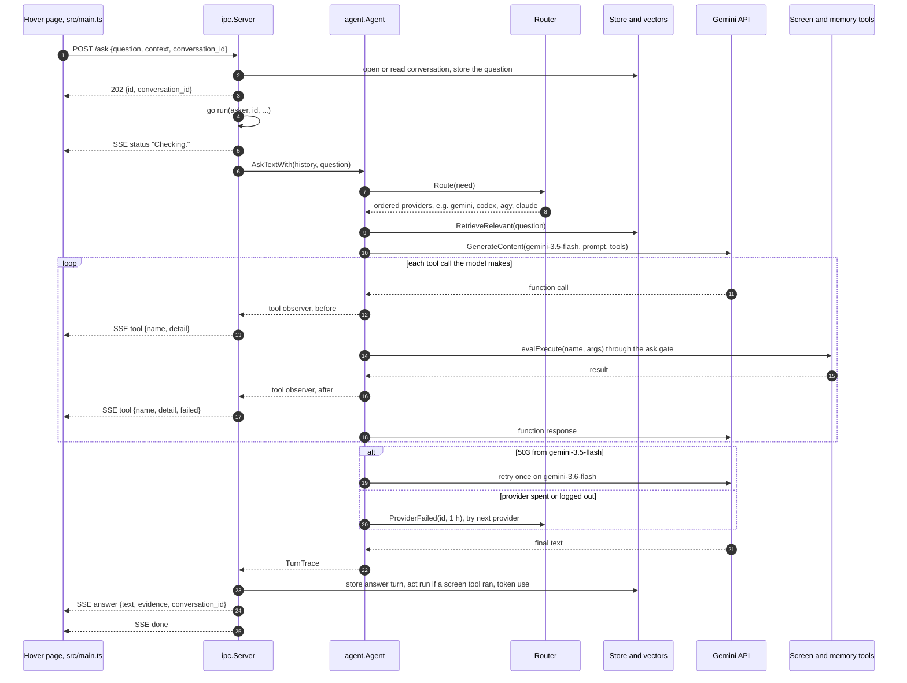

# June architecture

June is one Go daemon plus one Tauri window process. The daemon binds `127.0.0.1:6942`, owns every piece of state under `~/.local/share/june`, runs the capture, memory, meeting, proactive and computer-use loops, and starts the window as its own child. The window has three pages (hover, main app, overlay) and talks to the daemon only over HTTP and the `/events` server-sent event stream. A small GNOME Shell extension lists and raises windows for the daemon over D-Bus. Every model call leaves the machine except transcription, diarization, embeddings, the optional local text model and the optional dream shadow model.

## Components

Sources:

- Port and bind: `cmd/daemon.go:39-44` (6942, override `JUNE_PORT`), bind in `runDaemon` at `cmd/daemon.go:96`. All routes except `/ping` sit behind the token wrapper, which also marks client presence for the embedder (`cmd/daemon.go:537-549`). Route table: `cmd/daemon_routes.go:78-253`.
- Window child process: `runWindow` at `cmd/daemon.go:741`, `cmd/window.go:182-193`. Page labels and URLs: `app/src-tauri/tauri.conf.json` (`main`, `app` = `next.html`, `overlay` = `overlay.html`). The hover is toggled by SIGHUP to the pid in `window.pid`, sent by a GNOME custom shortcut: `app/src-tauri/src/lib.rs:260-282`. The overlay page does not read the daemon itself; Rust reads `/events` and forwards each event: `app/src/overlay/main.ts:1-5`, `app/src-tauri/src/overlay.rs:144-152`.
- Extension: interface with `ActivateByPid`, `ActivateByTitle`, `ActivateByWmClass`, `List`, answering only June's own binary: `packaging/gnome-extension/june@june.local/extension.js:5-27,77-106`. The daemon dials it off the startup path (`cmd/daemon.go:652`) and uses `List` for the focused window and window frames (`cmd/daemon.go:628-650`).
- Tracker: sampled every 2 s with a configurable dwell time (`cmd/daemon.go:251`), with a Gemini vision fallback when accessibility text is thin (`cmd/daemon.go:256-263`). Events drain into the store and the compiler (`cmd/daemon.go:534`).
- Memory: summarizer and compiler on Gemini with a Codex then Claude hand-over on 429/503 (`cmd/daemon.go:172-195`, `cmd/daemon.go:689`); vector index at `<data>/vectors`, 768 dims, 10,000 cap (`cmd/daemon.go:224`).
- Background loops and their cadence: safety-net flush 1 h, episodic compaction 12 h, note consolidation 6 h, working-state tick 5 min, dreaming tick 5 min, image aging 24 h (`cmd/daemon.go:271-509`).
- Remote backends: Gemini text `gemini-3.5-flash`, fallback `gemini-3.6-flash` on 503, Live default `gemini-3.1-flash-live-preview`, background default `gemini-3.5-flash-lite`, TTS `gemini-3.1-flash-tts-preview` (`internal/config/gemini.go:12-33,102`). Claude runs `claude -p` with June's tools on a per-ask MCP HTTP server on `127.0.0.1:0` (`internal/agent/claude.go:1,92,323`). Codex posts to `chatgpt.com/backend-api/codex/responses` with the user's ChatGPT login and runs no binary (`internal/agent/codex.go:27-28`). Antigravity is a long-lived `agy` child (`internal/agent/agy_session.go:45`). Grok answers duties only (`internal/agent/router.go:47-53`, `asks: false`). An `ollama-cli` provider is accepted in config and has no backend (`internal/brain/brain.go:31-32`).
- Tracing: `june.log` in the data dir, rotated at 20 MiB with three old generations; OTLP export only when `OTEL_EXPORTER_OTLP_ENDPOINT` is set (`internal/obs/telemetry.go:25-70`).

## One ask from the hover to an answer

The hover posts the question, gets `202` with an ask id at once, and then reads every step of the answer off the `/events` stream under that id. The provider is chosen per ask by the router: capability filter, health filter, then rank with the user's pick first.

Sources:

- `POST /ask` handler, 202 before any model work, background `run`: `internal/ipc/ipc.go:346-388`. Status, tool, answer and done broadcasts: `internal/ipc/ipc.go:445,455,518-519`. Event types: `internal/ipc/ipc.go:41`.
- Hover client: `ask()` at `app/src/daemon.ts:117`, `events()` at `app/src/daemon.ts:132`, subscribed in `app/src/main.ts:156-158`.
- Routing: `askRouted` at `internal/agent/ask.go:431-451`; order rules at `internal/agent/router.go:5-9,161-198`; one-hour breaker at `internal/agent/router.go:30`; hand-on only while no action has run at `internal/agent/router.go:233-249`.
- Memory lookup before the first model call: `internal/agent/ask.go:507`.
- Act run and token filing after the turn: `internal/ipc/ipc.go:102-131`, `internal/ipc/ipc.go:480-497`.
- While any screenshot is taken, the daemon tells the window to hide and waits a settle time, then shows it again, so the hover is not in the picture: `cmd/daemon.go:569-577`.

## Where data lives

Every path below is under the data dir, `$JUNE_DATA_DIR` if set, else `$XDG_DATA_HOME/june`, else `~/.local/share/june` (`internal/config/config.go:446-457`). The directory is created 0700 (`internal/config/config.go:526-528`, `internal/obs/telemetry.go:32-36`).

| Path | What writes it | Source |
|---|---|---|
| `db`, `db-wal`, `db-shm` | SQLite store: episodes, notes, threads, summaries, diary, conversations, act runs, lessons | `cmd/daemon.go:114` |
| `frames/` | episode JPEGs, aged after 14 days | `internal/db/store.go:96`, `cmd/daemon.go:512-520` |
| `vectors/` | chromem vector index | `cmd/daemon.go:224` |
| `recordings/` | meeting `mic.wav`, `system.wav`, transcript, minutes | `internal/recorder/recorder.go:141,402` |
| `whispercpp/` | `whisper-cli`, `ggml-medium.bin`, `ggml-silero-v6.2.0.bin` (user installs) | `internal/recorder/whispercpp.go:21-54` |
| `sherpa/` | diarizer binary, `lib/`, two ONNX models (user installs) | `internal/recorder/diarize.go:16-50` |
| `dreams/` | nightly trace JSONL and replay artifacts | `internal/dream/dream.go:569`, `internal/dream/replay.go:304` |
| `study/` | weekly distillation output | `cmd/daemon.go:468` |
| `dream-now` | marker file that forces a dream run | `cmd/daemon.go:487` |
| `june-config.json` | app config, 0600 | `internal/config/config.go:460-462` |
| `ipc-token` | per-start IPC token | `internal/ipctoken/ipctoken.go:20`, `cmd/daemon.go:537` |
| `portal-input-token` | RemoteDesktop restore token | `internal/input/token.go:12` |
| `brain_quota.json` | Gemini daily request counts | `internal/brain/quota.go:79-81` |
| `brain_usage.json` | provider allowance readings | `internal/brain/usage.go` via `cmd/daemon.go:153` |
| `june.log` | daemon log, 0600, rotated | `internal/obs/telemetry.go:39` |
| `window.pid` | Tauri process id for the hotkey | `app/src-tauri/src/lib.rs:260` |
