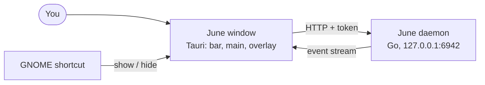
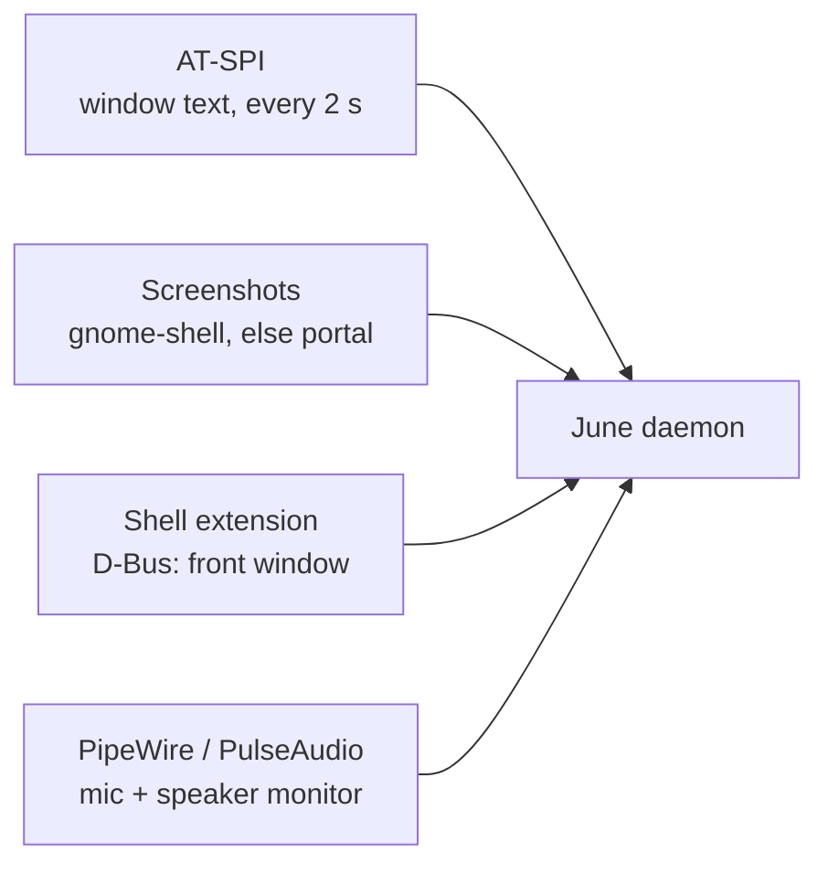
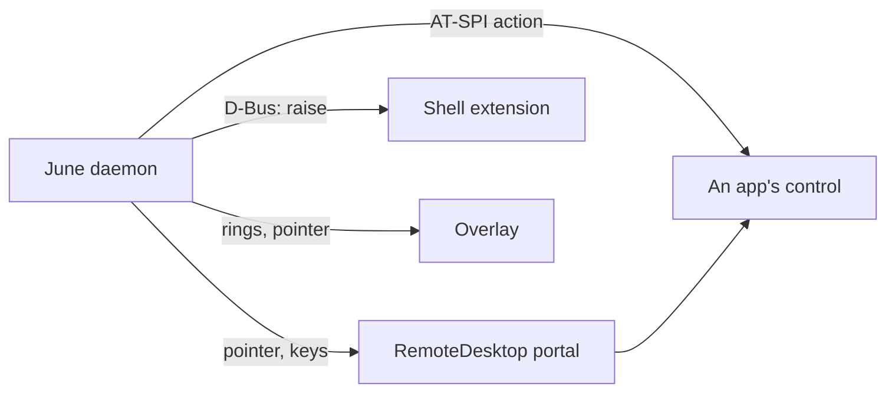
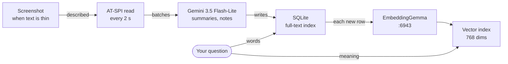
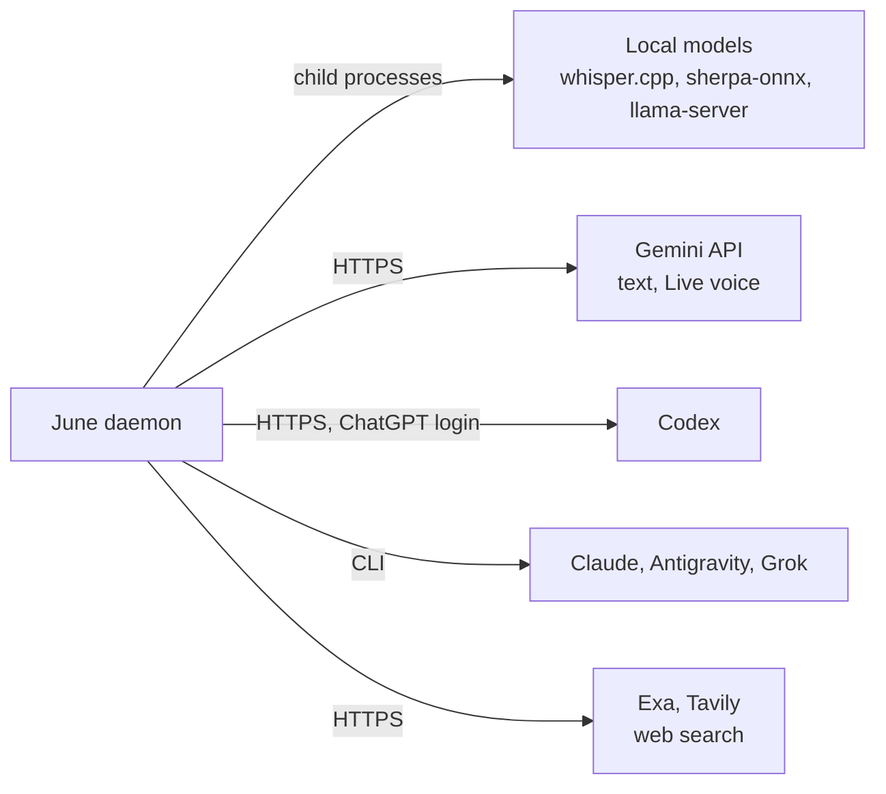
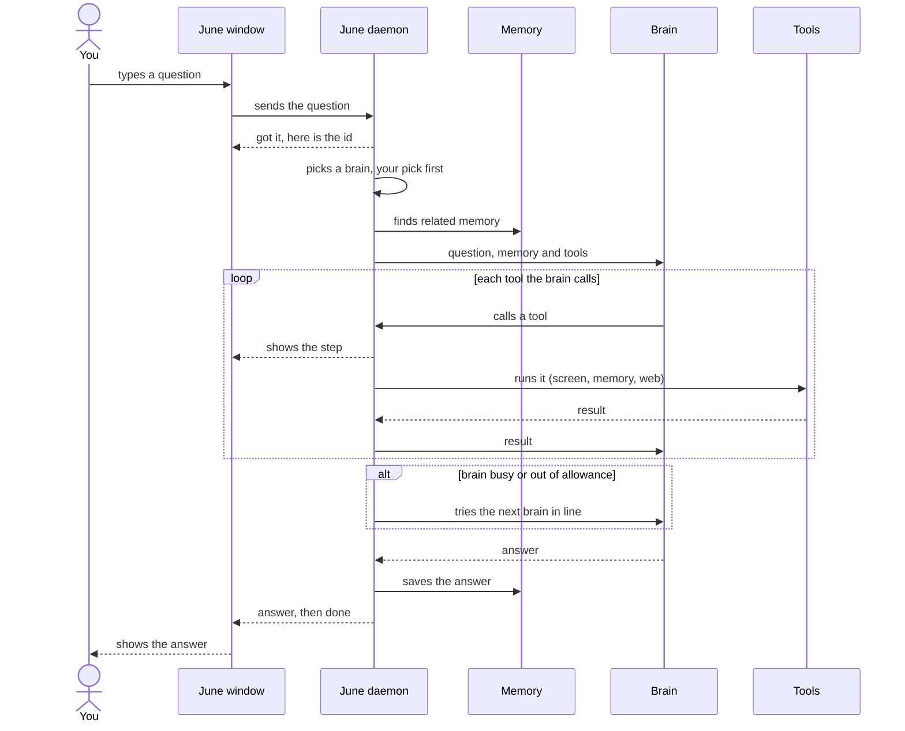

# June architecture

June is two processes on your Linux machine. The June daemon is one Go process that listens on 127.0.0.1:6942 and runs all the time: it watches the screen through AT-SPI, records meetings through PipeWire or PulseAudio, keeps memory in SQLite with a vector index, answers questions and drives the desktop through the xdg RemoteDesktop portal. The June window is a Tauri app, started by the daemon, with three pages: the hover bar, the main window and a click-through overlay. Speech to text, speaker labels, embeddings and two optional text models run locally as child processes. Everything else goes to a cloud model over HTTPS or through a vendor CLI.

## The window and the daemon

Only the daemon and the window can talk to each other: each start writes a fresh token that every request must carry. The overlay page reads nothing itself; the Tauri side reads the event stream and passes each drawing event on. Every screenshot hides the hover bar first, so June never sees itself.

## What the daemon reads from the desktop

## How the daemon acts on the desktop

## The parts

| Part | What it does |
|---|---|
| June daemon | Go process on 127.0.0.1:6942; holds all data, runs every loop below, starts the window |
| June window | Tauri app: hover bar, main window, overlay that draws the pointer |
| Window link | HTTP requests plus a server-sent event stream; a new token each start |
| Hotkey | a GNOME custom shortcut signals the window to show or hide the bar |
| GNOME Shell extension | answers over D-Bus: which window is in front, where each sits, raise one |
| AT-SPI | the accessibility bus June reads window text and controls from, every 2 seconds |
| Screenshots | gnome-shell's screenshot call, else the xdg screenshot portal |
| RemoteDesktop portal | real pointer and keyboard input; the desktop asks permission once |
| Meeting capture | PipeWire or PulseAudio: your mic and the speaker monitor, as two recordings |
| Memory | SQLite with full-text search, a vector index of 768-dim embeddings, screenshots |
| Brains | Gemini API first for questions, then Codex, Antigravity and Claude |

## From screen to memory

When the AT-SPI text of a window is too thin, as in a video or some browser pages, June takes a screenshot and asks Gemini to describe it. The summaries are written by Gemini 3.5 Flash-Lite. When Gemini answers 429 or 503, Codex and then Claude take over. A search runs the full-text index and the vector index together and merges the two lists. The vector index holds up to 10,000 entries.

Background work on memory runs on a timer:

| Job | How often |
|---|---|
| Save what is still waiting to be summarized | every hour |
| Merge summaries older than 7 days into one per day | every 12 hours |
| Merge duplicate notes and drop passing details | every 6 hours |
| Update "what you are doing now" | every 5 minutes |
| Check whether it is time for the night run | every 5 minutes |
| Delete screen pictures older than 14 days | every day |

What each memory layer stores, how search ranks it, how it ages and repairs itself, and what the night run does are in [memory](memory.md).

## Local and cloud models

Each local model, its port and who gets the GPU are in [GPU and models](gpu-and-models.md).

## One question from the hover bar to an answer

The window sends the question and gets an id back at once. Every step after that arrives on the live stream under that id, so the hover bar can show each tool as it runs.

How the brain is picked:

1. Drop any brain that cannot do what the question needs.
2. Drop any brain that failed in the last hour because its allowance ran out, it was overloaded, or you were logged out.
3. Put your chosen brain first.

When Gemini 3.5 Flash is overloaded, June retries once on Gemini 3.6 Flash. A question moves to the next brain only while nothing on screen has been clicked or typed yet, so a half-done action is never repeated by a second brain. A question that used a screen tool is also saved as a past run for later learning (see [computer use](computer-use.md)).

## What June keeps on disk

Everything lives in one folder in your home that only you can open.

| What | Notes |
|---|---|
| Database | summaries, notes, threads, diary, conversations, past runs, lessons |
| Vector index | one 768-dim embedding per note or summary |
| Screen pictures | deleted after 14 days |
| Meeting recordings | your mic, the call audio, transcript, minutes |
| Speech models | whisper and the speaker model, which you install |
| Night run traces | what the night run did, for replay |
| Settings | private to you |
| Log | rotated at 20 MB, three old copies kept |
| Screen control permission | saved so the desktop only asks once |
