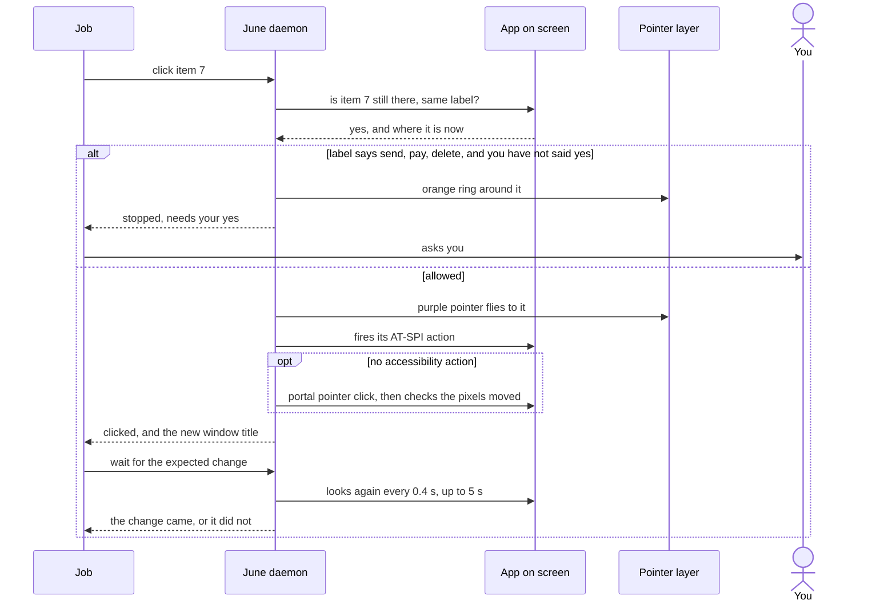

# Computer use

June works the desktop in two ways. A plain question can use screen tools inside its own answer. A longer goal runs as a job: each round June looks at the window, asks a model for the next step and the change it should cause, does the step, and checks that the change came. The check compares the window's text or pixels and makes no model call. Anything that looks like send, pay or delete waits for your yes.

## Starting and steering a job

In the hover bar, start the question with `do:` to make it a job. In the main window, a task goes straight to a job. You can stop, pause, resume or answer a job while it runs, and every step shows up live.

| Limit | Value |
|---|---|
| Time | 5 minutes |
| Model input | 200,000 tokens |
| Steps | 40 to start, raised to twice the model's own estimate if that is larger |
| Out of steps | June asks; a yes adds the larger of the estimate and the steps used |
| Out of time or tokens | the job ends as failed, with how far it got |
| Clock while June waits for you | stopped |
| Actions in one round | up to 8 |
| Wait for a change | up to 5 seconds, checked every 0.4 seconds |
| Missed checks before June asks | 3 in a row |
| Daemon restarted mid-job | picks up at the last step only when you press resume |

Worked case for steps: a job starts with 40. The model's first plan estimates 12 steps, so the job keeps 40, since 2 × 12 = 24 is smaller. With an estimate of 30 it gets 60. If all 60 are used, June asks, and a yes adds 60 more, for 120.

A job can only say it is done when its last step passed a check, and that change was not already on screen before the step. A done without such a check is sent back to the model.

## How June sees the screen

- **Controls.** June reads the front window over AT-SPI and keeps only things you can click, type into or read, numbered up to 100. When 12 or fewer lines change on a second look, only those lines are sent.
- **Screenshots.** June takes a screenshot of the front window through gnome-shell, or the xdg screenshot portal when gnome-shell's is taken. The hover bar hides for each one.
- **Windows.** The GNOME Shell extension answers over D-Bus which window is in front and where each one sits, and raises a window by class, then by title. Without the extension June opens apps by typing into the GNOME search through the portal keyboard.

## How June clicks and types

- **AT-SPI first.** A click on a numbered item fires the item's own AT-SPI action.
- **Portal pointer otherwise.** When the item has no such action, June clicks through the xdg RemoteDesktop portal, with one screen stream per monitor. The desktop asks your permission once, and a restore token saves the answer.
- **Checking a click landed.** After a pointer click, June compares the area around the point for up to 0.4 seconds. The click counts when more than 0.5% of that area changes.
- **One at a time.** Every click, key and scroll from every question and job goes through one lock, and each portal call times out after 2 seconds.
- **Typing.** June refuses to type control characters and never types into password, card or code fields.

## One click step

A click at a bare point on the screen, instead of a numbered item, forgets which field had focus. June then refuses to type until it has looked at the window again or clicked a numbered item.

## Things June will not do without you

June stops before a click, a key press or typing when the control's label, role or window title contains any of these: send, submit, post, publish, pay, buy, confirm order, place order, checkout, delete, remove, unsubscribe, sign out, transfer. A button whose whole label is Cancel, Back, Go back, Close, Dismiss, No thanks or Not now is never stopped.

The stop lifts only when your question has a yes word (yes, yeah, yep, go ahead, confirm, do it, please do) together with the same action word. Worked case: "yes, send it" unlocks a Send button for that question. It does not unlock a Delete button, and "send it" without a yes unlocks nothing.

June never types into, or clicks at a bare point on, a field labelled password, card, CVV, CVC, OTP, PIN or account number, even with your yes.

Inside a job, a stop becomes the job's question to you. Your answer is shown to the model, but the button stays locked for the next step, so the job asks again.

## The pointer on screen

The pointer layer is a see-through window that clicks pass through. It draws rings, arrows, boxes and a small triangle pointer that flies to each click.

| Colour | When |
|---|---|
| Purple | numbered items on screen, and each click |
| Orange | pointing something out, or a ring around a stopped button |
| Green | the work is done, just before the drawing fades |

Colour changes take 0.2 seconds and the drawing fades over 0.4 seconds.

## Lessons and memory feeding back

Every question that used a screen tool is saved as a past run with its steps and whether it worked. Jobs read past runs and lessons but do not write them yet.

After each run June writes at most 2 new lessons:

- A lesson from a click that failed and then worked another way.
- The model's own lesson, only when the run took 3 or more steps.

Lessons that say there is nothing to carry forward are thrown away. The lessons that were shown to the run are scored as a hit or a miss.

Each night, for every app with new lessons, the night run merges lessons that say the same thing and drops ones a newer lesson overrides.

Every new screen question and every new job starts by reading 2 past runs with a similar goal that worked, and 3 lessons, the ones with most hits first. Similar means close in meaning, found with EmbeddingGemma. A job reads this once, when it starts.
