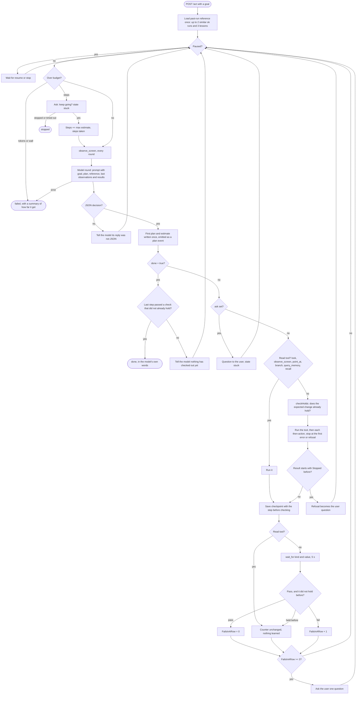
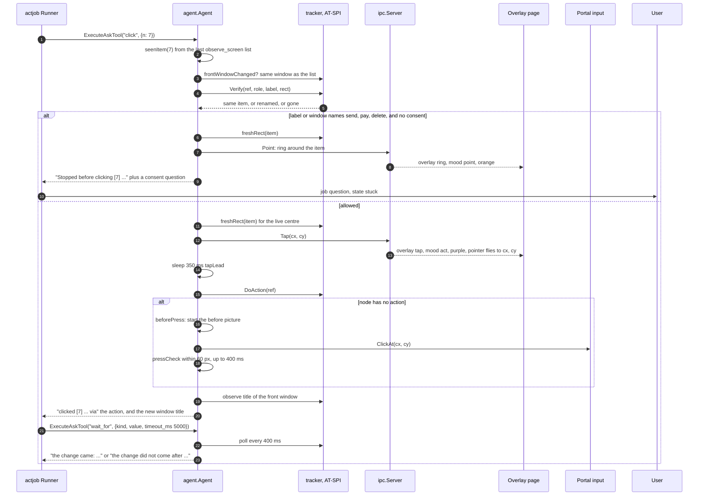
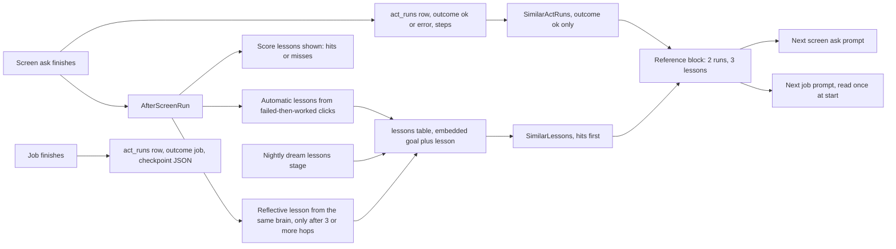

# Computer use

June drives the desktop in two ways. A plain ask can call screen tools inside its own tool loop. A longer goal runs as a job in the daemon (`internal/actjob`): each round it reads the screen, asks a model for one decision in JSON, runs the action through the same gated tool path an ask uses, and checks the expected change with a string match on the accessibility tree or a pixel diff, with no model call for the check. Clicks go through the element's own AT-SPI action when it has one and through the xdg-desktop-portal pointer when it does not. A control whose label or window names an irreversible action is not pressed without the user's explicit go-ahead.

## Starting and controlling a job

The hover opens a job when a question starts with `do:` (`app/src/state.ts:154`); the main window posts the goal directly (`app/src/next/api.ts:325`). Routes: `POST /act`, `GET /act/{id}`, `POST /act/{id}/stop|pause|resume|answer` (`cmd/daemon_routes.go:202-207`). Every progress event goes out on `/events` as type `act` with a one-line text and the full event as JSON (`internal/ipc/actjob.go:21-36`).

| Setting | Value | Source |
|---|---|---|
| States | planning, stepping, verifying, paused, stuck, done, stopped, failed | `internal/actjob/actjob.go:24-42` |
| Default budget | 5 min wall, 200,000 input tokens, 40 steps | `internal/actjob/actjob.go:51-53` |
| Step budget after the first plan | max(current, 2 × model's estimate) | `internal/actjob/decision.go:125-135`, set at `internal/actjob/actjob.go:578` |
| Out of steps | ask the user; a yes adds max(estimate, steps taken) | `internal/actjob/actjob.go:516-532` |
| Out of tokens or wall time | end as failed with a summary | `internal/actjob/actjob.go:516-523`, `internal/actjob/live.go:74-91` |
| Wall clock while waiting on the user | frozen | `internal/actjob/live.go:81-83` |
| Actions per round (burst) | up to 8, reads excluded | `internal/actjob/decision.go:31`, `burst` |
| Check timeout | 5,000 ms, polled every 400 ms | `internal/actjob/decision.go:19`, `internal/agent/waitfor.go:15` |
| Failed checks before asking | 3 in a row | `internal/actjob/decision.go:28` |
| Progress summary rewrite | every 5 rounds | `internal/actjob/decision.go:25` |
| Job brain | configured brain, then Claude CLI on any error | `cmd/daemon.go:672-673`, `cmd/daemon_workers.go:350-360` |
| Resume after a daemon restart | only on `POST /act/{id}/resume`, never automatic | `cmd/daemon.go:681-686`, `internal/actjob/actjob.go:355` |

Worked case for the budget: the default is 40 steps. The model's first reply says `"estimate": 12`, so the job keeps 40 (max of 40 and 24). With `"estimate": 30` it gets 60. If all 60 are used, the job asks; on a yes it gets 60 + max(30, 60) = 120 steps.

## A job from request to done

Sources:

- Reference loaded once per run through the `Referencer` seam: `internal/actjob/actjob.go:497-501`, `internal/agent/act_reference.go:118-121`; caps of 2 runs and 3 lessons: `internal/agent/act_reference.go:16-25`.
- Loop body in order: pause `internal/actjob/actjob.go:512`, budget `516-532`, observe `536`, model `544-553`, parse `556-564`, plan and estimate `566-585`, done guard `587-598`, ask `599-605`, no tool `606-611`, read tools `615-618` and `793-800`, pre-check `638-640`, burst `646-658`, stop-line hand-off `665-671`, checkpoint before verify `674-680`, verify `688`, counter `694-713`, stuck question `718-723`, summary `725-727`.
- The decision shape (`plan`, `next`, `tool`, `args`, `then`, `expect`, `done`, `estimate`, `say`, `ask`): `internal/actjob/decision.go:40-55`.
- The five check kinds: `title_contains`, `item_present`, `item_absent`, `field_holds`, `screen_changed`: `internal/act/waitfor.go:9-21`.
- Every job tool call goes through `Agent.ExecuteAskTool`, the ask's own gate: `internal/agent/ask.go:999-1009`. Each job gets its own screen scope so two jobs never share a numbered list: `internal/actjob/actjob.go:493-496`.

## How June sees the screen

- Accessibility tree: `observe_screen` walks the front window over AT-SPI (`tracker.Observe`, `internal/tracker/observe_linux.go:25`), keeps only clickable, typeable or readable roles, and numbers at most 100 items (`internal/act/observe.go:28,36-43,65,108`). A repeat look sends only the lines that changed when 12 or fewer changed (`internal/agent/tools_screen.go:139-176`).
- Pictures: `look` takes a screenshot of the front window (`tracker.CaptureFront`, `internal/tracker/screenshot_capture_linux.go:17`). The capture first claims the `org.gnome.Screenshot` bus name and calls gnome-shell's Screenshot method; when that name is taken it falls back to the portal Screenshot call (`internal/tracker/screenshot_linux.go:37-47,217-268`). The hover hides itself for each capture (`cmd/daemon.go:569-577`).
- Window frames and focus: the daemon asks the GNOME extension's `List` for which window is focused and where each window's frame is, and falls back to guessing from window size when the extension is absent (`cmd/daemon.go:626-650`). The same extension raises windows for `switch_window` and `open_app`, by WM_CLASS first, then title (`internal/agent/tools_screen.go:989-1022`); without it the tool falls back to the shell's search through the portal keyboard (`cmd/daemon.go:622-625`).

## How June clicks and types

- Accessibility action first: a numbered click fires the node's primary AT-SPI action, reading action names with `NActions` and `GetName` (`internal/tracker/act_linux.go:70-115`).
- Portal pointer and keyboard otherwise: `internal/input` opens an xdg-desktop-portal RemoteDesktop session with one ScreenCast stream per granted monitor (`internal/input/portal.go:79-91,137-199`). The first open shows the portal's consent dialog; the restore token is saved to `<data>/portal-input-token` so later opens skip it (`internal/input/token.go:11-30`). The session opens on the first tool call that needs it (`cmd/daemon.go:620-621`). One mutex serialises every press, type, click and scroll across all asks (`internal/input/portal.go:90-91`), and each portal call has a 2 s timeout (`internal/input/portal.go:97-98`).
- Press check: after a pointer press, pictures within 60 screen pixels of the point are compared for up to 400 ms at 80 ms intervals; a press counts as landed when more than 0.5% of those pixels move by more than 24/255 in any channel (`internal/agent/press_check.go:15-28,48-80`).
- Typing: `type_text` refuses control characters and refuses secret fields outright (`internal/agent/tools.go:561-608`, `internal/agent/stopline.go:35-37`). `press_key` sends Enter, Space and Ctrl+Enter style chords through the same stop line as a click (`internal/agent/tools_screen.go:591`, `internal/agent/tools.go:614-620`).

## One click step

Sources: `clickNumbered` at `internal/agent/tools_sequence.go:181-232`; `stillThere` and `freshRect` at `internal/agent/tools_screen.go:887-920`; `stopBeforeClick` at `internal/agent/tools_screen.go:870-885`; `tapAt` and the 350 ms lead at `internal/agent/tools_screen.go:563-575`; overlay tap and ring hand-off at `cmd/daemon.go:604-611`; wait prefixes at `internal/act/waitfor.go:24-29`. A click at a bare point (`clickPoint`, `internal/agent/tools_sequence.go:235-272`) always clears the known keyboard focus afterwards, so `type_text` refuses until a new `observe_screen` or numbered click.

## The stop line

A click, a focused key press, or typing into a field is stopped when the target's label, role or window title matches any of: send, submit, post, publish, pay, buy, confirm order, place order, checkout, delete, remove, unsubscribe, sign out, transfer (`internal/agent/stopline.go:12,24-33`). A control whose whole label is Cancel, Back, Go back, Close, Dismiss, No thanks or Not now is never stopped (`internal/agent/stopline.go:15`). A field labelled password, card, CVV, CVC, OTP, PIN or account number, or with role `password text`, is never typed into and never clicked by bare point (`internal/agent/stopline.go:18,35-37`, `internal/agent/tools_sequence.go:152-153`).

The stop lifts only when the ask's own question contains an affirming word (yes, yeah, yep, go ahead, confirm, do it, please do) together with the same action word, or when the ask carried `"go": true` (`internal/agent/stopline.go:21,40-43,88-96`, `internal/ipc/ipc.go:352,462`). Worked case: "yes, send it" unlocks a Send button in that ask; it does not unlock a Delete button, and "send it" without "yes" unlocks nothing.

Inside a job the refusal becomes the job's question to the user (`internal/actjob/actjob.go:665-671`). The answer is stored with the goal and shown to the model, but it is not put on the context of the next tool call, so the same control stays locked and the job asks again (`internal/actjob/actjob.go:664`).

## The overlay pointer

The overlay is a transparent, click-through Tauri page (`overlay.html`). Rust reads `/events` and hands each event to the page, which draws rings, marks, arrows, paths, boxes and circles, and flies a triangle pointer to each tap (`app/src/overlay/main.ts:1-5`, `app/src-tauri/src/overlay.rs:144-152`). The colour of the ink, pointer and label follows a mood:

| Mood | Colour | When | Source |
|---|---|---|---|
| neutral | `#7b68f5` | `marks` (numbered screen items), and after any fade-out | `app/src/overlay/main.ts:44-50,299`, `app/src/overlay/draw.ts:305-310` |
| point | `#fb7a1e` | ring, arrow, line, path, box, circle | `app/src/overlay/draw.ts:309` |
| act | `#7b68f5` | `tap`, and a ring that ripples as a press: its label is a click word, or it lands on the same rectangle as the previous ring within 2 s | `app/src/overlay/main.ts:321-323,351-354`, `app/src/overlay/draw.ts:77,307,309,479-483` |
| done | `#2fb46e` | `clear`, just before the fade | `app/src/overlay/main.ts:309-313`, `app/src/overlay/draw.ts:306` |

Colour changes tween over 200 ms (`app/src/overlay/main.ts:250-253`) and the whole drawing fades over 400 ms (`app/src/overlay/main.ts:42`).

## Lessons and memory feeding back

- Asks write: every ask that used a screen tool is filed as an act run (`internal/ipc/ipc.go:102-127`) and then `AfterScreenRun` scores the lessons it was shown and writes at most 2 new ones, the reflective one only after 3 or more tool hops (`internal/ipc/ipc.go:93-98`, `internal/agent/ask.go:1012-1015,1128-1156`). Lessons that say there is nothing to carry forward are refused at the store (`internal/db/lessons.go:47-66`).
- Night: the dream run merges and drops each app's lessons (`internal/dream/lessons.go:1`, `internal/dream/dream.go:437-442`).
- Read back: every screen ask and every job reads the same block of past runs and lessons (`internal/agent/act_reference.go:123-133`). Past runs are chosen from rows with outcome `ok` only (`internal/db/act_reference.go:141-147`).
- Jobs read but do not write. A job's checkpoint is stored in `act_runs` with outcome `job` (`internal/db/act_jobs.go:15-16,32-56`), which `SimilarActRuns` excludes, and nothing in `internal/actjob` or `internal/ipc/actjob.go` calls `AfterScreenRun` or `AddLesson`. A finished job therefore never becomes a past-run reference or a lesson.
