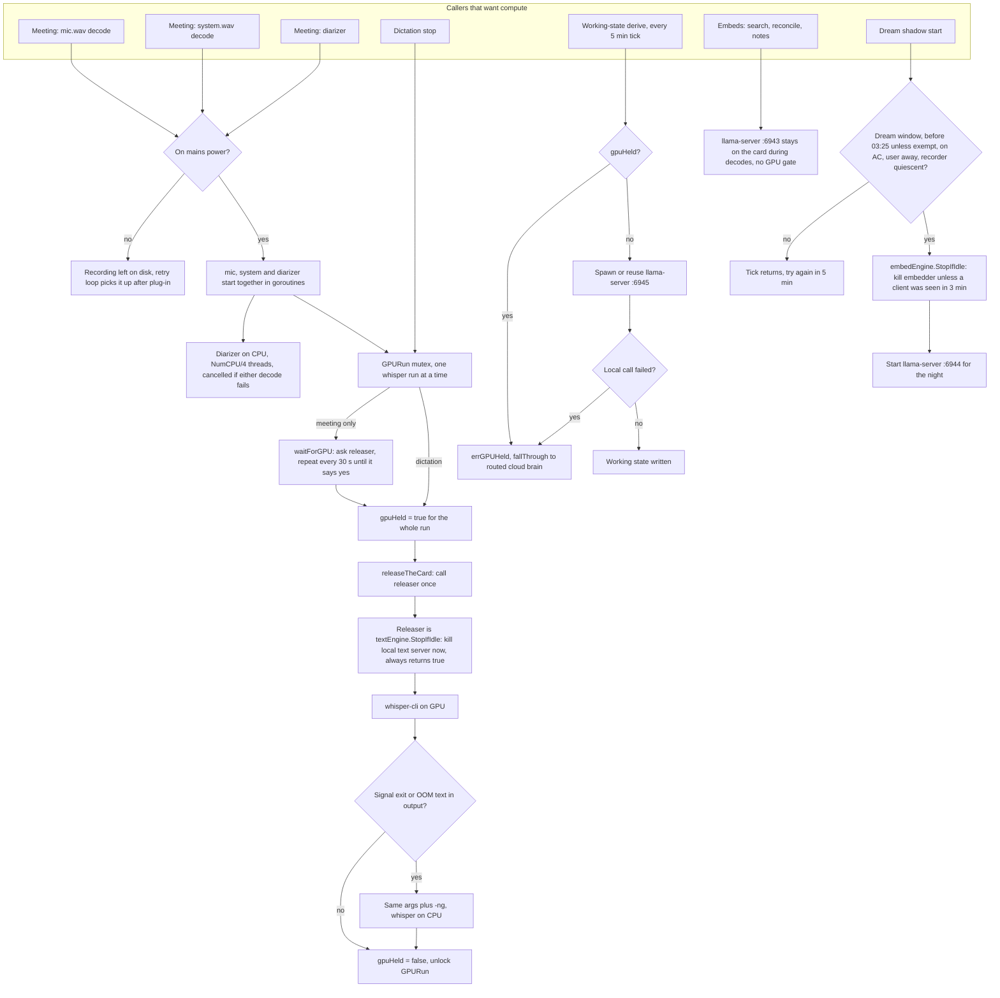
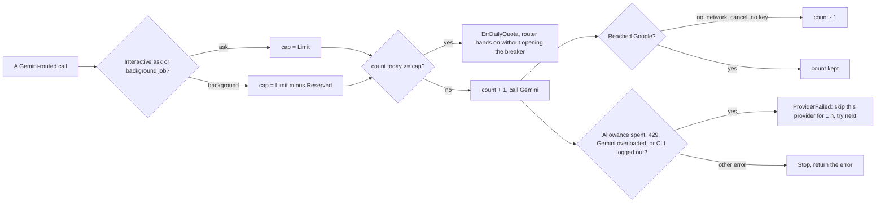

# GPU and models

June runs five kinds of model on the machine: whisper.cpp for speech to text, the Silero voice-activity model inside whisper.cpp, the sherpa-onnx speaker diarizer, EmbeddingGemma-300M in a llama-server child, and up to two instruction-tuned GGUF models in further llama-server children. Everything else (asks, voice, screen vision, memory summaries, meeting minutes, dreaming) goes to a remote provider. The one shared GPU is arbitrated by a process-wide mutex around every whisper run, a "whisper holds the card" flag that the local text server obeys, and a CPU retry when a decode runs out of device memory.

## Local models

| Model | Runs in | Files and where the code looks | Flags the code passes | Device | Threads | Lifetime |
|---|---|---|---|---|---|---|
| whisper-medium | `whisper-cli` child per run | `<data>/whispercpp/whisper-cli` and `ggml-medium.bin` beside it, or `$JUNE_WHISPER_CPP` | meeting: `-f -np -et 2.20 -lpt -0.70 -mc 160 -t N -m model -l auto [-dev N] [--vad -vm silero] [--prompt]`; dictation: `-f -np -nt -et -lpt -m model -l auto [-dev N] [--prompt]` | Vulkan device `transcribe.gpu_device` when above 0, else whisper.cpp's first device; `-ng` (CPU) on the retry | GPU run: `NumCPU/2`. CPU run or `JUNE_TRANSCRIBE_THREADS` set: `NumCPU/4` or the variable. Dictation passes no `-t`. | one process per decode |
| Silero VAD v6.2.0 | inside `whisper-cli` | `ggml-silero-v6.2.0.bin` beside `whisper-cli` | `--vad -vm <path>`, meeting runs only, and only when the file exists | same as whisper | same as whisper | same as whisper |
| sherpa-onnx speaker diarization | `sherpa-onnx-offline-speaker-diarization` child | `<data>/sherpa/` with `segmentation-3.0.onnx`, `wespeaker_en_voxceleb_CAM++.onnx`, `lib/`; or `$JUNE_SHERPA` | `--segmentation.num-threads --embedding.num-threads`, then `--clustering.num-clusters=K` when the speaker count is read off the meeting window, which needs `transcribe.speaker_count_from_screen` (off by default), else `--clustering.cluster-threshold` (default 0.8) | CPU | `NumCPU/4` or `JUNE_TRANSCRIBE_THREADS`, for each of the two thread flags | one process per meeting, system audio only |
| EmbeddingGemma-300M | `llama-server` child on `127.0.0.1:6943` | `embed.llama_server` and `embed.model_path` in config | `--embedding -c 8192 --parallel 4 -b 2048 -ub 2048 -ngl 99 [--device D]` | `embed.device`, e.g. `Vulkan1`; dropped after a start that dies | llama-server default | spawned on first embed or first authenticated request; kept while a client was seen in the last 3 min; reaped after 10 min idle |
| local text model | `llama-server` child on `127.0.0.1:6945` | GGUF at `local_text.model_path`, else `dream.model_path` | `-c 32768 -ngl 99 [-dev D]` | `local_text.device`, else `dream.device` | llama-server default | spawned on first working-state derive; reaped after 15 min idle; 180 s cap per generation |
| dream shadow model | `llama-server` child on `127.0.0.1:6944` | GGUF at `dream.model_path` | `-c 8192 -ngl 99 [-dev D]` | `dream.device` | llama-server default | started before a night's stages, stopped after; replies are logged and never acted on |

Sources:

- whisper binary, model, VAD names and lookup: `internal/recorder/whispercpp.go:23-54`. Language, device and VAD flags: `internal/recorder/whispercpp.go:60-76`. Decoder thresholds and thread flag for meetings: `internal/recorder/transcribe.go:40-42,54`. Dictation flags: `internal/ipc/dictate.go:343-363`. Device setting: `internal/config/config.go:171-173`.
- Thread counts: `whisperThreads` and `transcribeThreads` at `internal/recorder/transcribe.go:149-173`.
- Diarizer names, lookup and flags: `internal/recorder/diarize.go:16-25,37-50,83-97`; speaker-count setting: `internal/config/config.go:177-178`.
- Embedding server: `internal/embed/engine.go:25,30-49,58-60,66-76`; port 6943 and idle 10 min: `internal/config/config.go:255,264`; model name `embeddinggemma-300m`, 768 dims: `internal/config/config.go:258-261`; query and document prefixes, 4,000-rune cap, up to 3 halvings on a too-long reply: `internal/embed/local.go:16-71`.
- Local text server: `internal/embed/text.go:48-74`; port 6945, 15 min idle, 180 s cap and the model-path and device fallbacks: `internal/config/config.go:276-360`. It answers only the working-state job: `cmd/daemon.go:407`.
- Dream shadow: `internal/dream/shadow.go:25-30`, port 6944 `internal/config/config.go:126`, wired at `cmd/daemon.go:497-507`.
- A GGUF that fails to start on its named device is restarted without `--device`/`-dev`: `internal/embed/server.go:242-256`.
- The GGUF file names for the text and shadow models are not in the code. They are whatever the config names.

## Remote models

| Job | Provider and model | Source |
|---|---|---|
| typed ask | router order: Gemini `gemini-3.5-flash` (then `gemini-3.6-flash` on 503), Codex backend, Antigravity CLI, Claude CLI; user's pick first | `internal/agent/ask.go:431-451`, `internal/agent/router.go:47-53` |
| live voice | Gemini Live, default `gemini-3.1-flash-live-preview` | `internal/config/gemini.go:12-18` |
| voice preview | `gemini-3.1-flash-tts-preview` | `internal/config/gemini.go:33` |
| screen vision for memory | Gemini through the summarizer's `AnalyzeScreen` | `cmd/daemon.go:256-259` |
| memory duties, minutes, proactive, dreaming | routed brain, background model `gemini-3.5-flash-lite` by default, per-duty override in `background_brains` | `cmd/daemon.go:387-424`, `internal/config/gemini.go:102-136` |
| computer-use job rounds | configured brain, then Claude CLI on any failure | `cmd/daemon.go:672-676` |
| web search | Exa first, Tavily second | `internal/agent/websearch.go:19-23` |

## What happens when several want the machine at once

Sources, one per rule in the diagram:

- Battery deferral: `internal/recorder/recorder.go:465-470`; decode goroutine: `internal/recorder/recorder.go:471`.
- Mic, system and diarizer in parallel, diarizer cancelled on a failed decode: `internal/recorder/recorder.go:643-671`.
- `GPURun` is a `sync.Mutex`: `internal/recorder/whispercpp.go:137`. Meetings take it at `internal/recorder/transcribe.go:61-63` only when a model sits beside the binary. Dictation takes it at `internal/ipc/dictate.go:266-270`, and its 3 min decode timeout starts after the lock is held (`internal/ipc/dictate.go:44,267`). Go's `sync.Mutex` does not promise which waiter goes next.
- `waitForGPU` polls every 30 s under the lock, meetings only: `internal/recorder/whispercpp.go:152-165`, called at `internal/recorder/transcribe.go:65`.
- `gpuHeld` raised for the whole run, released after, and `releaseTheCard` called once: `internal/recorder/whispercpp.go:80-102,140-143`.
- The releaser and the gate are wired to the local text server, not the embedder: `cmd/daemon.go:215-220`. `TextEngine.StopIfIdle` calls `stopNow`, which always returns true: `internal/embed/text.go:40-45`, `internal/embed/server.go:96-105`. With this wiring `waitForGPU` never loops.
- OOM detection (negative exit code, or `erroroutofdevicememory`, `allocatememory`, `out of memory`, `segmentation fault` in output) and the `-ng` retry: `internal/recorder/whispercpp.go:87-125`.
- Text server refuses while `gpuHeld`: `internal/embed/text.go:36-37,82-84`. The daemon puts `fallThrough(textEngine.Generate, routed brain)` in front of the working-state job: `cmd/daemon.go:407`, `cmd/daemon_workers.go:350-360`.
- The embedding server has no GPU gate and stays on the card during a decode, sized at about 0.65 GB against whisper-medium's 2.2 GB on a 4 GB card per the comment at `cmd/daemon.go:215-216`.
- Embedder presence pin: `internal/embed/engine.go:25,58-60,97-106`; the pin is refreshed on every authenticated request at `cmd/daemon.go:543-546`.
- Dream start conditions: `internal/dream/dream.go:256-293`; curfew 03:25 for a Claude dream brain: `internal/dream/dream.go:22,265-268`, exemption for other brains `cmd/daemon.go:494`. Recorder quiescence: `internal/recorder/recorder.go:240`. Embedder asked to leave before the shadow starts: `internal/dream/dream.go:360-368`, `cmd/daemon.go:506`.

### Worked case

A meeting ends while the machine is on mains, and the user presses the dictation key 10 s later.

1. The recorder starts three goroutines. The diarizer begins on the CPU with `NumCPU/4` threads. One of the two decodes takes `GPURun`; the other blocks on it. The code does not order them.
2. The first decode sets `gpuHeld`, the local text server is killed if running, and `whisper-cli` decodes with `NumCPU/2` threads and `--vad`.
3. The dictation's `POST /dictate/stop` resamples the audio to 16 kHz and blocks on `GPURun` behind whichever meeting decode still holds or waits for it.
4. A working-state tick that lands during any of these decodes reads `gpuHeld = true`, gets `errGPUHeld`, and is answered by the routed cloud brain.
5. Embeds for search keep going to the resident embedder on port 6943.
6. If any whisper run prints `ErrorOutOfDeviceMemory`, the same run is repeated with `-ng` on the CPU, still inside `GPURun`, so no other decode starts in between.

## Remote quotas and hand-over

Sources:

- Limits: `gemini-3.5-flash` 20 per day with 8 reserved for asks, `gemini-3.5-flash-lite` 500 with 100 reserved, any other `gemini-` model 20 with 8: `internal/brain/quota.go:43,51-56,59-67`. Counter file `brain_quota.json`, day boundary at midnight America/Los_Angeles: `internal/brain/quota.go:79-81,193-210`.
- Take, refund, band cap: `internal/brain/quota.go:110-180`. Asks use the full cap: `cmd/daemon.go:384`.
- Hand-over for duties: `internal/brain/routed.go:19-50`. Hand-over for asks and the 1 h breaker: `internal/agent/router.go:30,214-249`.
- Worked case for the background band on `gemini-3.5-flash-lite`: cap = 500 − 100 = 400. The 401st background call that day gets `ErrDailyQuota` before any request is sent, and the router passes the duty to the next provider. An ask on the same model still has 100 calls left.
