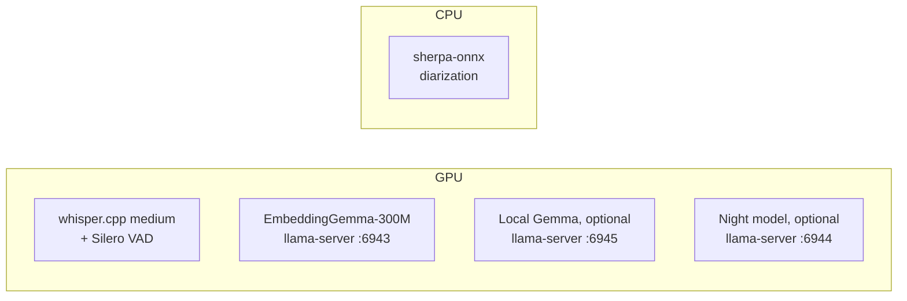
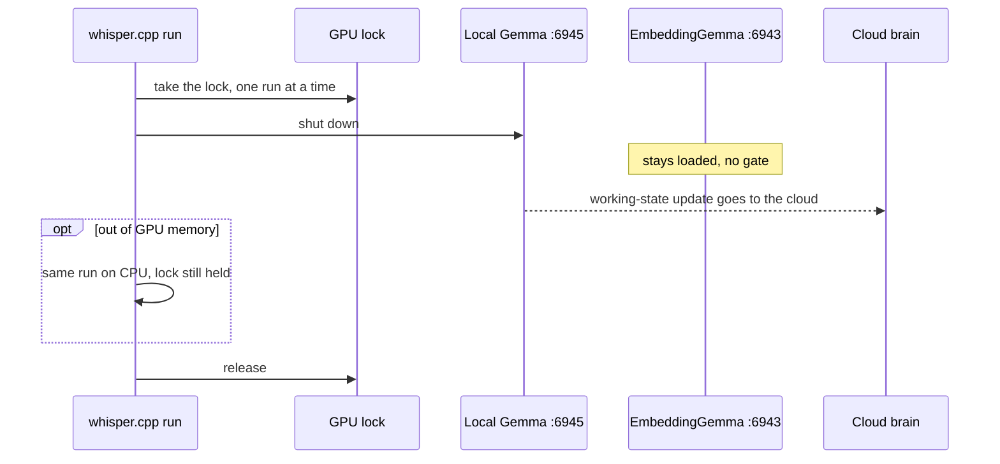
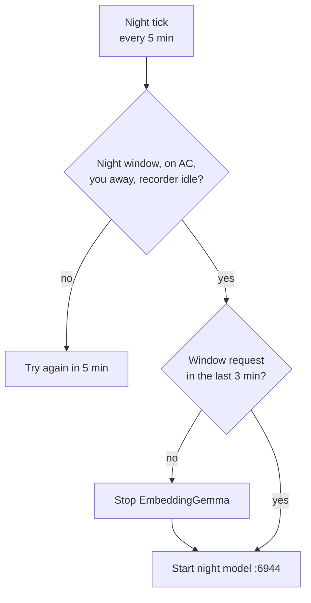
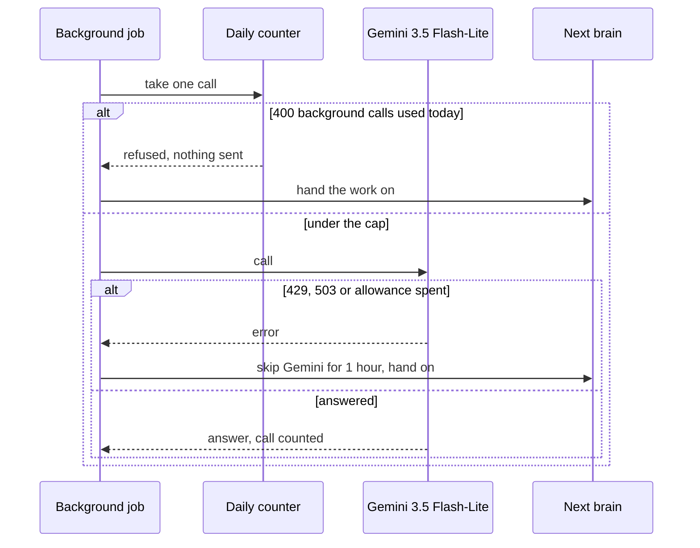

# GPU and models

June runs six models locally and sends everything else to the cloud. whisper.cpp with Silero VAD turns speech into text, sherpa-onnx labels who spoke, and up to three llama-server processes serve EmbeddingGemma and two optional Gemma-class text models. Questions, voice, screenshots, memory summaries, meeting minutes and the night run go to Gemini or a vendor CLI. One GPU lock and one "whisper holds the card" flag decide who gets the GPU.

## Models on your machine

| Model | What for | Runs as | Device | Lifetime |
|---|---|---|---|---|
| whisper.cpp medium | meeting and dictation speech to text | one process per recording | GPU (Vulkan), CPU on retry | one run |
| Silero VAD v6.2 | finds the speech in a meeting recording | inside whisper.cpp | GPU | meetings only, when installed |
| sherpa-onnx diarization | who spoke when, on the call audio | one process per meeting | CPU | one run |
| EmbeddingGemma-300M | 768-dim embeddings for search | llama-server on port 6943 | GPU | starts on first use, stops after 10 min idle |
| Local Gemma (optional) | "what you are doing now" | llama-server on port 6945, 32k context | GPU | starts on first use, stops after 15 min idle, 180 s cap per answer |
| Night model (optional) | shadows the night run, replies only logged | llama-server on port 6944 | GPU | started for the night run, stopped after |

You install whisper.cpp, the Silero model and the two sherpa-onnx models yourself. The two optional text models are any GGUF you name in the settings. A llama-server that fails to start on the GPU you named is started again without naming one.

whisper.cpp on the GPU uses half your CPU cores. whisper.cpp on the CPU, and sherpa-onnx, use a quarter. sherpa-onnx guesses how many people spoke unless you turn on reading the count off the meeting window.

## Models in the cloud

| Job | Model |
|---|---|
| Typed questions | Gemini API 3.5 Flash (3.6 Flash once on 503), then Codex, Antigravity CLI, Claude CLI |
| Voice | Gemini Live: 3.1 Flash Live by default, 2.5 native audio as an option |
| Voice preview | Gemini TTS |
| Screenshots, summaries, minutes, briefs, night run | Gemini 3.5 Flash-Lite unless a setting names another; Codex, then Claude on 429 or 503 |
| Computer-use jobs | your chosen brain, then the Claude CLI on any error |
| Web search | Exa, then Tavily |

The Claude CLI gets June's tools through a small MCP server the daemon opens for each question. Codex is called over HTTPS with your ChatGPT login and needs no local binary. Antigravity runs as a long-lived CLI process. The Grok CLI does background work only and never answers your questions.

## Who gets the GPU

The night model has its own start check, every 5 minutes:

Three rules keep the GPU from running out of memory:

1. One lock allows one whisper.cpp run at a time, meeting or dictation. Before a run starts, the local Gemma server is shut down.
2. While whisper holds the GPU, the local Gemma server refuses work, and the 5-minute "what you are doing now" update is written by the cloud brain instead.
3. If whisper.cpp runs out of GPU memory, the same run is repeated on the CPU while it still holds the lock, so no other run starts in between.

EmbeddingGemma has no GPU gate and never leaves for whisper. It takes about 0.65 GB against whisper medium's 2.2 GB, so both fit on a 4 GB card, and memory search keeps working during a transcription.

The night run starts only when it is night, the machine is on mains power, you are away and no meeting is being processed. With Claude as the night brain it must start before 03:25. Before the night model starts, EmbeddingGemma is stopped if the window has sent no request for 3 minutes.

A meeting that ends while the machine is on battery is left on disk. Transcription starts after AC returns.

### Worked case

A meeting ends on mains power, and you press the dictation key 10 seconds later.

1. The mic recording and the call recording each queue for the GPU lock. sherpa-onnx starts on the CPU straight away, and is cancelled if either transcription fails.
2. The first recording takes the lock. The local Gemma server is shut down. whisper.cpp runs with Silero VAD on half the CPU cores.
3. Your dictation and the second recording both wait on the lock. The lock does not fix which of them goes next.
4. A "what you are doing now" update during any of these runs is refused locally and answered by the cloud brain.
5. Memory searches keep using EmbeddingGemma on port 6943.
6. If a run prints an out-of-memory error, it is redone on the CPU while still holding the lock.

## Cloud quotas

June counts its own Gemini API calls per day and holds some back for your questions.

| Model | Calls per day | Held back for your questions |
|---|---|---|
| Gemini 3.5 Flash | 20 | 8 |
| Gemini 3.5 Flash-Lite | 500 | 100 |
| Any other Gemini model | 20 | 8 |

The day resets at midnight Pacific time. A call that never reached Google, because the network was down or it was cancelled, is not counted.

Worked case on Flash-Lite: background work may use 500 − 100 = 400 calls. The 401st background call that day is refused before it is sent, and the work goes to the next brain in line. Your questions on the same model still have 100 calls.

When a brain says its allowance is spent, it is overloaded, or you are logged out of it, June skips that brain for one hour and uses the next one. Any other error stops the call and reports it.
