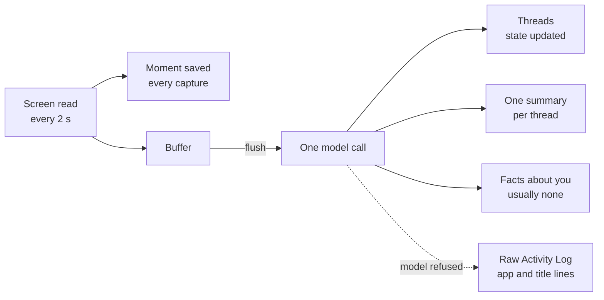
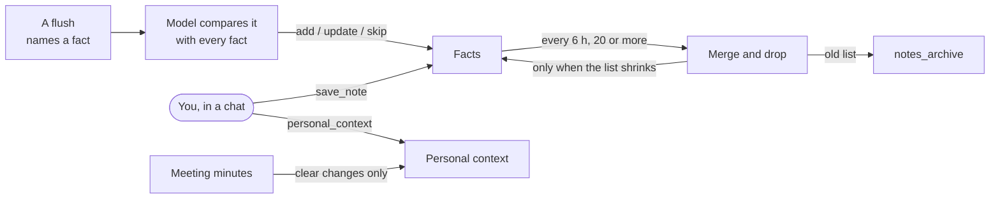
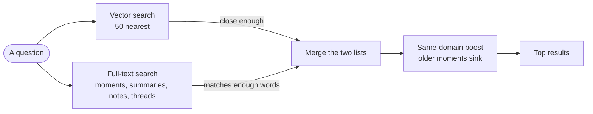
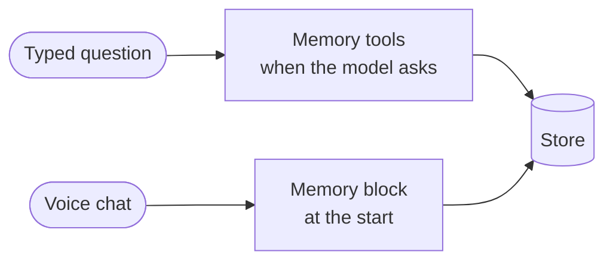
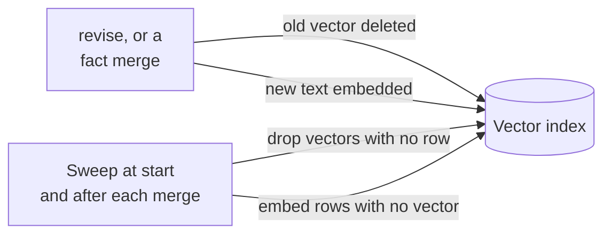
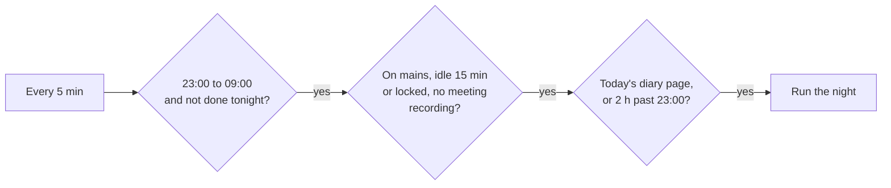

# Memory

June remembers in layers. Every screen it reads is kept as a moment. Every few minutes one model call turns the newest moments into a summary per thread of work, updates each thread's state, and pulls out any lasting fact about you. Each evening June writes a diary page about your day, and each night, while the machine is idle, it tests what it believes about you, rewrites one page on who you are, and folds old diary pages into weeks, months and years. Everything sits in one SQLite file with full-text search, plus a vector index of 768-dim EmbeddingGemma embeddings.

## What June keeps, and in what shape

| Layer | Table | One row looks like |
|---|---|---|
| Moment | `episodes` | app, window title, screen text, and for a thin screen a picture's description and the picture itself |
| Summary | `nodes`, type `summary` | `{"same_task": true, "task_name": "june memory doc", "summary": "wrote the dreaming section"}` |
| Day digest | `nodes`, type `digest` | 3 to 6 sentences of prose for one day |
| Thread | `threads` | subject, kind (work, project, entertainment, learning, routine, person), state, how often and how lately seen |
| Fact | `notes`, kind `fact` | one sentence, for example "runs a local inference server" |
| Procedure | `notes`, kind `procedure` | `How I did open the build log: opened Terminal, typed make, pressed Enter.` |
| Personal context | `personal_context` | a subject such as `identity` or `vexil-quorin`, and prose; one row per subject |
| Working state | `working_state` | one paragraph of at most 120 words, written to you as "you" |
| Diary | `diary` | prose under a day and a kind: `day`, `week`, `month`, `year`, `dream`, or `understanding` with no day |
| Hypothesis | `hypotheses` | a statement of at most 200 characters, confidence, status (open, promoted, retired), times tested, an evidence log |
| Past run and lesson | `act_runs`, `lessons` | see [computer use](computer-use.md) |

Summaries hang in a tree: day, then session, then task, then summary. When a day is rolled into a digest, its summaries move under the digest instead of being deleted.

The vector index names each entry `<source>:<id>`, as in `note:3`. A screen longer than 1,500 characters is split into passages of up to 1,500 characters that overlap by 200, ending at a line break or space where one falls in the last quarter. The first passage of episode 42 keeps the id `episode:42`, and later ones are `episode:42#1`, `episode:42#2`. Worked case: a 3,200-character screen becomes three passages starting near characters 0, 1,300 and 2,600, so three vectors for one moment.

## From screen to summary

Every capture is written as a moment and also added to a buffer. A capture with no title and no screen text, or a title of "new tab", "untitled" or "desktop" with no text, is left out of the buffer. The buffer is flushed when one of these holds:

| Trigger | Rule |
|---|---|
| App switch | the app changed, the buffer holds 3 or more captures, and 3 minutes have passed since the last flush |
| Words | the buffer reaches 1,500 words of screen text |
| Time | an hour has passed since the last flush, checked on the next capture and by an hourly timer |
| Shutdown | the daemon waits up to 45 seconds for the last flush |

The flush sends the buffer and the threads seen in the last 14 days to one model call. The model answers with one entry per thing you were doing at once, so watching a show while coding gives two threads. For each entry June updates or creates the thread, writes one summary, and links that stretch of moments to the thread. The model is told who you are from the `identity` entry of personal context, so your own name in a calendar entry is read as you.

The call goes to Gemini 3.5 Flash-Lite, or to the local text model when there is no Gemini key, or to whatever brain a `background_brains` entry in the config names for it. When the call fails, or the shutdown wait runs out, the buffer is saved as a "Raw Activity Log" summary of app and title lines, capped at 2,000 characters.

## Facts and personal context

A fact from a flush is compared with every stored fact. The model says add, update an existing fact with merged wording, or skip. It is told to prefer update and skip, and to skip commands, flags, paths, versions and today's bug.

Every 6 hours, when there are 20 or more facts, one call merges near-duplicates and drops task detail. The new list replaces the old one only when it is shorter and not empty. The old list is copied to `notes_archive` first, so a wrong merge can be traced and undone. Meeting minutes, procedures and other note kinds are never touched by this pass.

Personal context holds what is known for certain: who you are, the people in your life, preferences you stated. It is written by the `personal_context` tool when you say it, and after a recorded meeting when the minutes clearly change an entry; a meeting write resting only on a name heard in audio is dropped, and every meeting write is logged. There is one row per subject, and writing the same subject again edits the row. The fact merge never touches it, and it is small enough to be read whole, so it has no search.

## How June finds a memory

Both searches run on every memory question. A word match counts only when it matches at least half the question's words, up to 2. A vector hit counts only when it scores above 0.40 (0.28 on Windows, both changeable in the config) and within 0.06 of the best hit.

The two lists are merged by rank: each result scores 1 / (50 + rank) in each list it appears in, and the scores add. Results from the same domain as your current window (work or personal) get × 1.15. Moments then lose half their score for every 7 days of age. Summaries, facts, threads and diary pages do not age. A summary is dropped when its own day digest is in the same results, so one day is not counted twice.

Worked case: a fact ranked 1st by words and 3rd by meaning scores 1/51 + 1/53 = 0.0385. A moment from today ranked 1st by words only scores 1/51 = 0.0196. The same moment 14 days old scores 0.0196 × 0.25 = 0.0049.

## How memory reaches a question

A typed question starts with no memory in its prompt. The model reaches memory through tools: `query_memory` for a topic, `recall` for a time span or a subject, `query_store` for a read-only SQL count or join, and `personal_context`. It writes through `save_note`, `add_task` and `revise`, which fixes or removes a wrong note, thread, action item or task.

A voice chat has no time to call a tool mid-sentence, so it starts with a block of memory:

| Line | What it holds |
|---|---|
| `[understanding]` | the understanding page, cut at 2,000 characters |
| search hits | up to 6, found with the working state and the last 2 tasks from the past 2 hours |
| `[thread:project] june memory doc — writing the dreaming section` | up to 6 threads seen in the last 2 days |
| `[now]` | the working state |
| personal context | every entry |

The working state is rewritten from the 6 live threads, the 10 newest summaries and the facts that match them. A 5-minute timer checks it, and it is only rewritten when 10 minutes have passed and either the set of windows you used changed or 5 new summaries arrived. The local text model writes it when one is installed, with the brain picked in Settings behind it; without one, Gemini writes it.

## Making old memory smaller

| What | When | Rule |
|---|---|---|
| Summaries to a day digest | every 12 hours | days older than 7 days with 2 or more summaries, 50 summaries per call |
| Screen pictures | every day | deleted after 14 days; the description stays |
| Screen text | never | kept for good |
| Vector index | on each new vector | holds up to 10,000; the oldest vector goes first |
| Diary days to a week | each night | a Monday-to-Sunday week with all 7 pages, all older than 7 days |
| Diary weeks to a month | each night | every week of the month written, all older than 10 weeks |
| Diary months to a year | each night | all 12 months written, all older than 6 months |
| Empty conversations | each night | deleted after 24 hours |
| Screen runs | each night | the newest 2,000 kept; failed runs kept 30 days; runs a procedure was written from kept for good |
| Night traces | every day | deleted after 90 days |

A day that already has a digest passes that digest back to the model with the new summaries, so the day ends with one digest covering both. A week missing one daily page is never rolled up.

## When memory goes stale or breaks

| Problem | What catches it |
|---|---|
| A note or thread is wrong | `revise` rewrites it, deletes its old vector and embeds the new text |
| The fact merge renumbers every fact | the old ids' vectors are deleted, and the next sweep embeds the new rows |
| A row lost its vector, or a vector lost its row | a sweep at start and after each fact merge, up to 5,000 embeds with the local embedder, 200 with a paid one |
| Gemini answers 429 or 503 | the day digest and the working state go to Codex instead; a flush that fails is saved as a Raw Activity Log summary |
| The working state lags | the 10-minute rule above; a failed rewrite does not reset the clock |
| The daemon restarts | each paid timer job reads when it last ran and keeps its schedule, so a restart does not buy another call |
| The machine slept through 22:00 | the next start writes yesterday's diary page first |
| The machine was off for nights | the next night reads back to the last finished night, up to 20 days |
| A night was cut short | the next tick resumes after the last finished stage |
| A belief stops being true | 2 contradictions retire it; 30 days open and never tested retires it |
| The same lesson in three wordings | the night merges them into one |
| A task was finished in a meeting | the night closes it when a meeting, a diary page or a note from the last 7 days says it is done |

## Dreaming

### When a night starts

The diary page comes from the evening close at 22:00. When it is still missing 2 hours after 23:00, the day's summaries stand in for it. No night starts after 03:25, so the night does not open a Claude usage window that runs into the workday, unless the config names a dream brain other than Claude, which may run until 09:00. Touching the file `dream-now` in the data folder starts a night on the next tick with every check skipped. A night that fails 3 times waits for the next night.

While a night runs, June checks every 5 seconds for a key press or mouse move in the last 30 seconds, or an unlock when the screen was locked at the start, and stops the night on either one. Each stage commits in one transaction, so a stop loses at most the call in flight.

### The stages

| Stage | What it does |
|---|---|
| Test hypotheses | the judge reads up to 24 KB of evidence (the last 6 days of diary pages, summaries, 30 active threads, meeting minutes, newest first) and marks each open hypothesis supported, contradicted or unclear; up to 5 new hypotheses are taken from the diary pages |
| Rewrite understanding | one call rewrites the understanding page from the promoted and high-confidence hypotheses, every year page, 12 month pages, 8 week pages and the recent day pages |
| Roll up the diary | one call per week, month and year page, by the rules above |
| Replay the day | runs only when a local dream model is set: each summary is read alone, up to 300 in 45 minutes, and sorted into piles per thread in a file for you to read |
| How I did X | for each goal a screen run reached, the shortest run that worked becomes one procedure note, if it took 12 steps or fewer and no note exists yet |
| Merge lessons | for each app with new lessons, merges ones that say the same thing and drops ones a newer lesson overrides |
| Close done tasks | closes tasks that writing from the last 7 days says are finished |
| Prune | removes empty conversations and old screen runs by the rules above |
| Morning report | the night's brain writes a diary entry of kind `dream` in prose, with the counts underneath; you can ask "what did you dream last night" |

The judge's promote and retire are recommendations, and fixed rules decide. A hypothesis is promoted only when it has been tested 3 times and is at least 7 days old. Worked case: a hypothesis born on 1 October and supported on the nights of 2, 3 and 4 October, with the judge asking to promote it on the 4th, stays open, and the morning report says the promotion was refused. Supported again on 8 October, it is 7 days old and has 4 tests, so it is promoted.

Every call's raw reply is written to `dreams/<night>.jsonl` in the data folder. When a local dream model is set, it answers the same prompts for comparison, and its answer is used when the main dream brain fails. Each Sunday June reads these traces and appends new lessons to `study/lessons.md` in the data folder, which later night and live prompts include.
